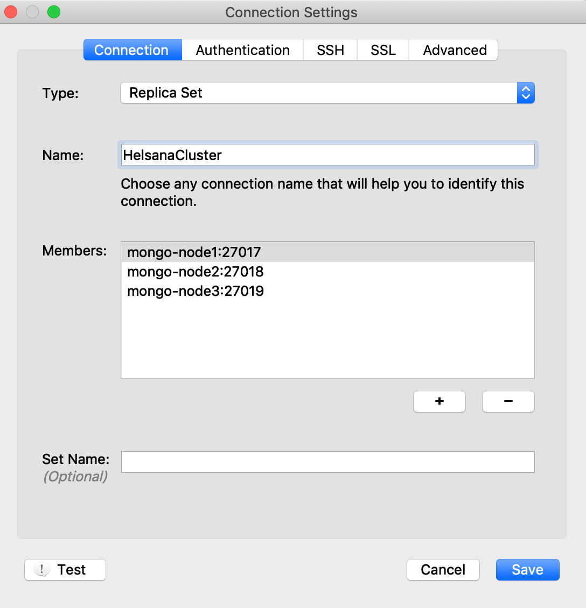

### Host configurations

#### Create the data directories

```bash
mkdir ~/mongodb-cluster/data/node1
mkdir ~/mongodb-cluster/data/node2
mkdir ~/mongodb-cluster/data/node3
```

#### Create the config directories

```bash
mkdir ~/mongodb-cluster/config/node1
mkdir ~/mongodb-cluster/config/node2
mkdir ~/mongodb-cluster/config/node3
```

Add a `mongo.config` into each of the node1, node2 and node2 configuration folders with the following content

```yaml
replication:
  oplogSizeMB: 1024
  replSetName: helsana
net:
  port: 27017
```

```yaml
replication:
  oplogSizeMB: 1024
  replSetName: helsana
net:
  port: 27018
```

```yaml
replication:
  oplogSizeMB: 1024
  replSetName: helsana
net:
  port: 27019
```

#### Add the following the `/etc/hosts`


```bash
# mongodb cluster configuration
127.0.0.1 mongo-node1
127.0.0.1 mongo-node2
127.0.0.1 mongo-node3
```

#### Docker setup

##### Create a network

```bash
docker network create my-mongo-cluster
```

##### Start up the containers

```bash
docker run --name mongo-node1 -d --net my-mongo-cluster -v ~/mongodb-cluster/data/node1:/data/db -v ~/mongodb-cluster/config/node1:/etc/mongo -p 27017:27017 mongo:4.0.6 --config /etc/mongo/mongo.config 
docker run --name mongo-node2 -d --net my-mongo-cluster -v ~/mongodb-cluster/data/node2:/data/db -v ~/mongodb-cluster/config/node2:/etc/mongo -p 27018:27018 mongo:4.0.6 --config /etc/mongo/mongo.config 
docker run --name mongo-node3 -d --net my-mongo-cluster -v ~/mongodb-cluster/data/node3:/data/db -v ~/mongodb-cluster/config/node3:/etc/mongo -p 27019:27019 mongo:4.0.6 --config /etc/mongo/mongo.config 
```

##### Verify that they are up and running

```bash
docker ps -a
```

```bash
CONTAINER ID        IMAGE               COMMAND                  CREATED             STATUS              PORTS                                 NAMES
dae526ee43c8        mongo:4.0.6         "docker-entrypoint.s…"   About an hour ago   Up 34 minutes       27017/tcp, 0.0.0.0:27019->27019/tcp   mongo-node3
af4623782ce5        mongo:4.0.6         "docker-entrypoint.s…"   About an hour ago   Up 24 minutes       27017/tcp, 0.0.0.0:27018->27018/tcp   mongo-node2
caac34cf1e57        mongo:4.0.6         "docker-entrypoint.s…"   About an hour ago   Up 7 minutes        0.0.0.0:27017->27017/tcp              mongo-node1
```

##### Initialize the `ReplicatSet`
 

```bash
docker exec -it mongo-node1 bash
mongo
```

```bash
rs.initiate(
config = {
      "_id" : "helsana",
      "members" : [
          {
              "_id" : 0,
              "host" : "mongo-node1:27017"
          },
          {
              "_id" : 1,
              "host" : "mongo-node2:27018"
          },
          {
              "_id" : 2,
              "host" : "mongo-node3:27019"
          }
      ]
  }
)
```


##### Check the status

```bash
helsana:PRIMARY> rs.status()
```

##### MongoDB GUI (Robo 3T)

```bash
brew cask install robo-3t
```

ReplicatSet connection configuration



##### Mongo client connection

```bash
brew install mongo
``` 

```bash
mongo --host helsana/mongo-node1:27017,mongo-node2:27018,mongo-node3:27019 test
```

this uses the connection url:

```bash
mongodb://mongo-node1:27017,mongo-node2:27018,mongo-node3:27019/test?replicaSet=helsana
``` 

##### Spring Data MongoDB connection

```yaml
spring:
  data:
    mongodb:
      uri: mongodb://localhost:27017,localhost:27018,localhost:27019/test?replicaSet=helsana
```

Resources:

- https://hub.docker.com/_/mongo
- https://stackoverflow.com/questions/31839777/how-to-configure-spring-data-mongodb-to-use-a-replica-set-via-properties
- https://docs.spring.io/spring-boot/docs/2.0.8.RELEASE/reference/htmlsingle/#boot-features-connecting-to-mongodb
- http://www.tugberkugurlu.com/archive/setting-up-a-mongodb-replica-set-with-docker-and-connecting-to-it-with-a--net-core-app